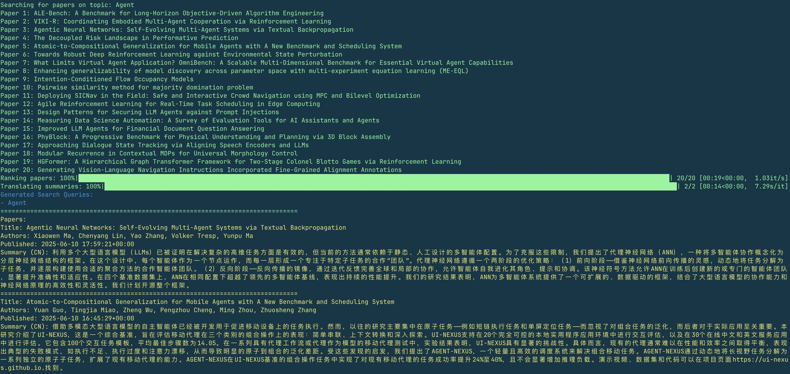

# Paper Agent

**Paper Agent** 是一个基于大语言模型（LLM）的论文检索与摘要翻译工具，支持从 arXiv 获取最新论文并按主题相关度进行排序和翻译。

## ✨ 功能特点

- 自动检索与指定主题相关的最新论文（基于 arXiv 数据）
- 使用 LLM 评估论文与主题的相关度，并进行智能排序
- 提供论文标题、作者信息（如 arXiv 提供）、摘要中文翻译、发表时间等信息
- 可自定义模型、接口地址与返回数量



## 📦 安装依赖

```bash
pip install -r requirements.txt
```

## 🚀 使用方法

```bash
python paper_agent.py "查询主题" \
  --max-results 5 \
  --api-key YOUR_API_KEY \
  --base-url https://api.deepseek.com \
  --model deepseek-chat
```

### 参数说明

- `"查询主题"`：要检索的论文关键词（如 `"LLM推理优化"`）。
- `--max-results`：最终输出的论文数量（默认值为 5）。
- `--api-key`：用于调用翻译模型的 API 密钥。
- `--base-url`：可选，指定兼容 OpenAI 接口的服务地址（如 DeepSeek、Moonshot 等）。
- `--model`：用于翻译和相关性评估的模型名称。

## ⚠️ 注意事项

- 本工具使用 `arxiv` 库进行论文检索，需确保本地网络连接稳定。
- `arxiv` 会检索约 `10 × max-results` 篇论文作为候选集。
- 所有候选论文将逐一由 LLM 进行相关度评分，该过程会调用多次接口，请合理评估 token 消耗。

